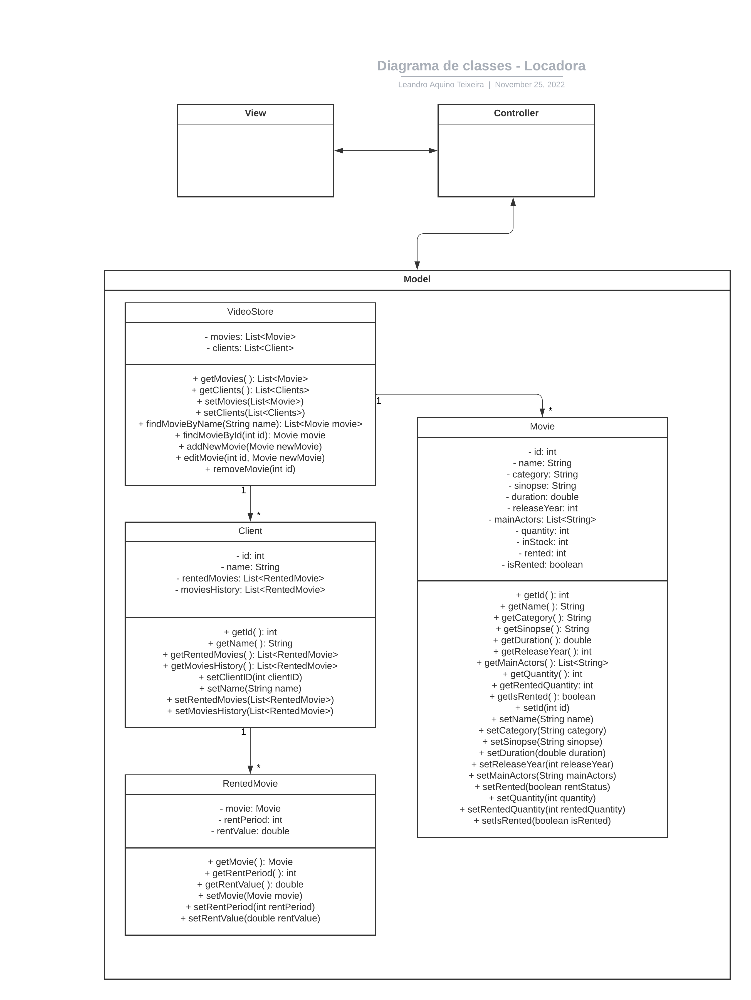

# Aula 18/08/2022 - Discussão sobre texto de Titus Winters

"We see three critical differences between programming and software engineering: time, scale, and the trade-offs at play. On a software engineering project, engineers need to be more concerned with the passage of time and the eventual need for change. In a software engineering organization, we need to be more concerned about scale and efficiency, both for the software we produce as well as for the organization that is producing it. Finally, as software engineers, we are asked to make more complex decisions with higher-stakes outcomes, often based on imprecise estimates of time and growth. Within Google, we sometimes say, “Software engineering is programming integrated over time.” Programming is certainly a significant part of software engineering: after all, programming is how you generate new software in the first place. If you accept this distinction, it also becomes clear that we might need to delineate between programming tasks (development) and software engineering tasks (development, modification, maintenance). The addition of time adds an important new dimension to programming. Cubes aren’t squares, distance isn’t velocity. Software engineering isn’t programming."

Titus Winters, Software Engineering at Google

### **Comentários**

O texto nos mostra alguns insights interessantes. Até o presente momento, acreditava que engenharia de software e programação propriamente dita eram a mesma coisa. Porém são coisas bem distintas.

Como Titus afirma, a Engenharia de Software está ligada à ações muito mais estratégicas do que só a programação de um novo software. Mesmo essa sendo parte integrante do processo de Engenharia de Software, este não pode ser resumido à somente isto. Engenharia de Software vai além, ela se preocupa com requisitos como performance, escalabilidade e decisões mais complexas.

# Aula 25/08/2022 - Lifecycle

## **Tema: Sistema de Locação de Filmes**

**Requisitos funcionais**
* Sistema deverá permitir a inserção, alteração e remoção de filmes, comportando informações sobre Categoria, Sinopse, Duração, Ano, Atores, Valor de Locação, Se está alugado ou não, Unidades disponíveis para locoação.
* Sistema deverá permitir a consulta dos filmes cadastrados, através de filtros pré-determinados pelo usuário.
* Sistema deverá permitir o gerenciamento da locação dos filmes, verificando se o filme se encontra disponível para ser alugado, para quem foi alugado, por quanto tempo, qual o valor pago pela locação.
* Sistema deverá permitir uma versão para o cliente final, onde o mesmo poderá verificar quais filmes existem disponíveis para locação e realização da locação e pagamentos através do próprio sistema.

**Requisitos não funcionais**
* Sistema deverá adotar estrutura MVC.
* Sistema deverá ser preferencialmente web, permitindo o acesso de diversos equipamentos, diminuindo as configurações necessárias à sua execução.
* Sistema deverá ser compatível com diversos sistemas operacionais, tais como Windows, Linux e MacOS, bem como Android e iOS.
* Sistema deverá ter uma interface amigável, com imagens e informações importantes sobre os filmes.
* O sistema deverá ser hospedado em servidores web que garantam alta disponibilidade do mesmo.

### Diagrama de Classes do Projeto

