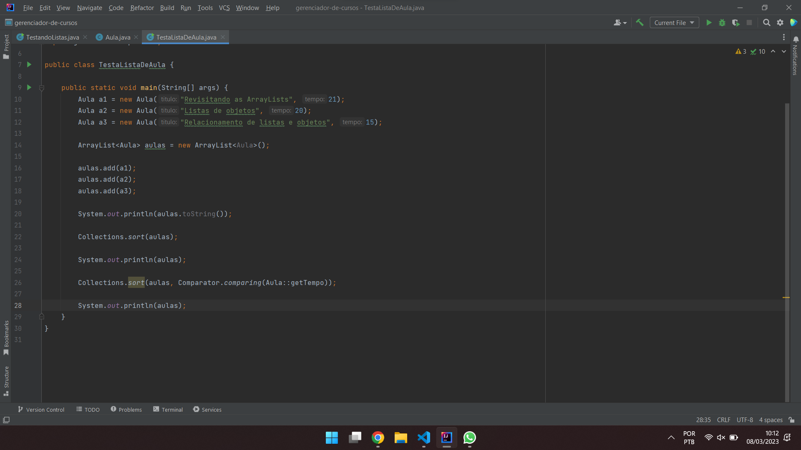

# Atividade - Análise das heurísticas de Jakob Nielsen com exemplos

### #1 Visibility of system status
Explicação da heurística: O design deve sempre manter os usuários informados sobre o que está acontecendo, através de feedbacks apropriados em um período razoável de tempo.

Exemplo:

Análise do exemplo: O Youtube sempre mantém os usuários cientes sobre o que está acontecendo, como por exemplo na imagem acima, o usuário tem ciência de qual altura o vídeo que está sendo exibido está, bem como sabe quais vídeos serão exibidos em sequência, com nome e duração de cada vídeo. Quando pausamos o vídeo por exemplo, ele imediatamente retorna um ícone no vídeo de pausa, reafirmando ao usuário que aquele vídeo está pausado.

### #2 Match between system and the real world
Explicação da heurística: O design deve falar a linguagem do usuário. Use palavras, frases e conceitos familiares ao usuário, ao invés de jargões internos. Siga padrões universais, fazendo a informação ser apresentada em uma ordem natural e lógica.

Exemplo:

Análise do exemplo:

### #7 Flexibility and efficiency of use
Explicação da heurística: Atalhos - escondidos de usuários novatos - podem aumentar a interação para o próximo usuário experiente, então o design pode atender tanto aos usuários inexperientes quanto aos experientes. Permita aos usuários a personalização de ações frequentes.

Exemplo:

Análise do exemplo:

### #8 Aesthetic and minimalist design
Explicação da heurística: Interfaces não devem conter informação que é irrelevamente ou raramente utilizada. Cada unidade extra de informação em uma interface compete com uma unidade relevante de informação, e diminui sua relativa visibilidade.

Exemplo:

Análise do exemplo: